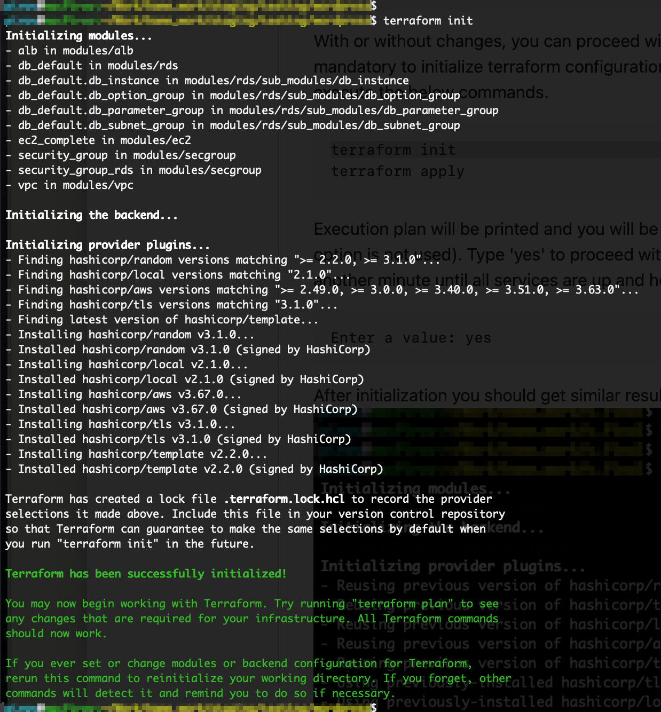

# AWS automated infrastructure creation and Wordpress semi-distributed system installation

The goal of this project is to create AWS infrastructure based on the Terraform configuration. And to deploy semi-distributed Wordpress system (multiple application units with single DB instance).


## Assumptions

It is expected that the user already has AWS CLI and Terraform CLI installed on his system. As well as AWS Access and Secret keys updated (or any other valid AWS authentication presented).


## Installation

Download the current project (git clone it, or else) to your system. You may want to review the default preset configurtion in terraform.tfvars file in the project root directory:

```hcl
region = "eu-west-1"
name   = "wordpress"

vpc_cidr_block     = "192.168.0.0/24"
wp_instances       = "2"
ami_id             = "ami-09ce2fc392a4c0fbc"
instance_type      = "t2.micro"
ec2_ebs_size       = 8
rds_instance_class = "db.t2.small"
db_name            = "WPDB"
db_user            = "wpadmin"
```
With or without changes, you can proceed with the creation of infrastructure and application deployment. It is mandatory to initialize terraform configuration before applying it for the first time. Go to project root directory and execute the below commands.
```bash
terraform init
terraform apply
```
Execution plan will be printed and you will be prompted whether to create the resurce (in case -auto-approve option is not used). Type 'yes' to proceed with the creation. End-to-end process will take ~5 min. It may take another minute until all services are up and healthy.
```bash
Enter a value: yes
```
After initialization you should get similar results:

After applying should be similar to:


## Outputs

### Description

| Name | Description |
|------|-------------|
| <a name="output_db_pass"></a> [db\_pass](#output\_db\_pass) | Database password |
| <a name="output_instance_id"></a> [instance\_id](#output\_instance\_id) | List of EC2 instance IDs. |
| <a name="output_instance_public_ip"></a> [instance\_public\_ip](#output\_instance\_public\_ip) | List of instance public IPs. |
| <a name="output_lb_dns_name"></a> [lb\_dns\_name](#output\_lb\_dns\_name) | Load balancer public FQDN address. |
| <a name="output_private_key"></a> [private\_key](#output\_private\_key) | Base64 encoded RSA private key. |

### Usage

To display output sensitive data use the following commands:
```bash
terraform output db_pass
terraform output private_key
```
Private key and DB password are also saved in separate files in 'credentials' directory under the project root.
```bash
credentials/db_pass
credentials/private_key.pem
```
You can SSH directly to any of the EC2 instances using the instance_public_ip from the output:
```bash
ssh -i credentials/private_key.pem ec2-user@<IP>
```

Use the lb_dns_name output to access the Wordpres home page.  
Also, individual public IP address can also be used to ensure each EC2 instance is up and running (without then need to login to the AWS console and check Target Group targets availability)


## Appendix

### Maintenance

Each Sunday morning at 3:00 am database tables optimization is performed. Before and after the operation the size of each table is gathered and stored in a log file. Optimization itself is also logged. All files are available on the first EC2 instance (<hostname>-01) under /tmp/
```bash
03:00 Sunday-size-before-optimize.log
03:00 Sunday-optimize.log
03:00 Sunday-size-after-optimize.log
```

### Useful commands/queries

Get details for running EC2 instances
```bash
aws ec2 describe-instances \
  --query "Reservations[*].Instances[*].{InstanceId:InstanceId,PublicIP:PublicIpAddress,Name:Tags[?Key=='Name']|[0].Value,Status:State.Name}" \
  --filters Name=instance-state-name,Values=running \
  --output table
```

Output should be similar to:
```bash
----------------------------------------------------------------------
|                          DescribeInstances                         |
+----------------------+---------------+------------------+----------+
|      InstanceId      |     Name      |    PublicIP      | Status   |
+----------------------+---------------+------------------+----------+
|  i-0123456789abcdefg |  Wordpress-01 |  12.345.678.90   |  running |
|  i-abcdefg0123456789 |  Wordpress-02 |  98.765.43.210   |  running |
+----------------------+---------------+------------------+----------+
```

Get the output of EC2 initialization. Useful for troubleshooting cloud init.

```bash
aws ec2 get-console-output --instance-id i-0123456789abcdefg --output=text
```


## Sources

 - [Hashicorp AWS/TLS/Local/Random provider documentation](https://registry.terraform.io/providers/hashicorp/aws/latest/docs)
 - [Terraform AWS modules](https://github.com/terraform-aws-modules)

